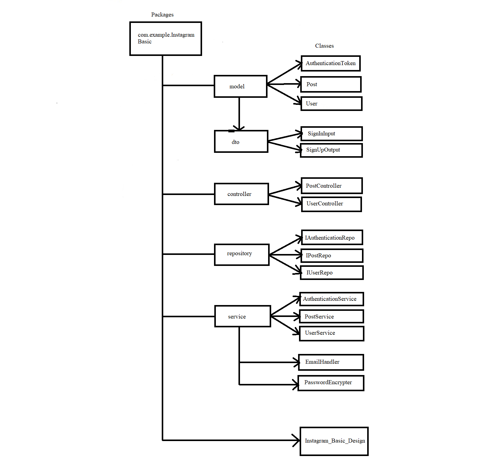

## **Frameworks and language used**
* SpringBoot Framework and java language.
## **Data Flow**

## **Data Structure used in your project**
* Arraylist
* MYSQL Database
## **Project Summary**

This is "Instagram_Basic" Application which follows MVC-architecture.In this application, I have created a package of InstagramBasicApplication within this package I have created Four more packages to define layer as given in DFD. The pupose of the project is, If user wants to create his account on Instagram then he has to be sign up and Only sign up user can able to sign in. The extra model is for authentication of user who has done signUp / signIn or not. Every User has unique email address and we get authorized through that email which generating token to making us accessible to that app. User can post multiple post so here post is owning side and User is our reference side so that's ,we are performing many-to-one mapping on it.And storing the data in mySQL using the dependency MYSQL Driver And JPA.For posing the data, we are performing crud operations on it with the help of endpoints like @GetMapping to get all the information of the Model, @PostMapping to create a Model Information using the attributes.That's the whole project meant. 

